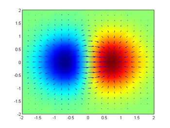

基于物理的流体渲染 ——从理论到实践

[TOC]

# 
数学理论

## 微积分

### 导数

### 微分

### 积分

### 全导数

### 偏微分

### 全微分

## 向量微积分

### 梯度

#### 梯度

在向量微积分中，**梯度** (gradient) 是一种关于多元导数的概括。平常的一元（单变量）函数的导数是标量值函数，而多元函数的梯度是向量值函数。多元可微函数 $f$ 在点 $\vec{P}$ 上的梯度，是以 $f$ 在 $\vec{P}$ 上的偏导数为分量的向量。就像一元函数的导数表示这个函数图形的切线的斜率，如果多元函数在点 $\vec{P}$ 上的梯度不是零向量，则它的方向是这个函数在 $\vec{P}$ 上最大增长的方向，而它的量是在这个方向上的增长率。

梯度向量中的幅值和方向是与坐标的选择无关的独立量。

将 2D 函数 $f(x, y) = xe^{−(x^2 + y^2)}$ 的梯度绘制为蓝色箭头，还绘制了这个函数的伪色图。

将函数 $f(x,y) = −(cos^2x + cos^2y)^2$ 的梯度描绘为在底面上投影的向量场。

#### 梯度的解释

假设有一个房间，房间内所有逇点的温度由一个标量场 $\phi$ 给出的，即点 (x, y, z) 的温度是 $\phi (x, y, z)$ 。假设温度不随时间变化。然后，在房间的每一点，该点的梯度将显示变热最快的方向。梯度的大小将表示在该方向上变热的速率。

考虑一座高度在 (x, y) 点的 H (x, y) 的山。H 这一点的梯度是在该点坡度（或者说斜度）最陡的方向。梯度的大小告诉我们坡度到底有多陡。

梯度也可以告诉我们一个数量在不是最快变化方向的其他方向的变化速度。再次考虑山坡的例子。可以有条直接上山的路，其坡度是最大的，则其坡度是梯度的大小。也可以有一条和上坡方向成一个角度的路，例如投影与水平面上的夹角为 60°。则，若最陡的坡度是 40%，这条路的坡度小一点，是 20%，也就是 40% 乘以 60% 的余弦。

这个现象也可以如下数学的表示。山的高度函数 H 的梯度点积一个单位向量给出表面在该向量的方向上的斜率，这成为方向导数。

#### 梯度的表示

二维梯度如下：
$$
\nabla{f(x, y)} = \begin{pmatrix} \frac{\partial{f}}{\partial{x}}, \frac{\partial{f}}{\partial{y}} \end{pmatrix} = \frac{\partial{f}}{\partial{x}} \vec{i} + \frac{\partial{f}}{\partial{y}} \vec{j}
$$
三维梯度如下：
$$
\nabla{f(x, y, z)} = \begin{pmatrix} \frac{\partial{f}}{\partial {x}}, \frac{\partial{f}}{\partial(y)}, \frac{\partial{f}}{\partial{z}} \end{pmatrix} = \frac{\partial{f}}{\partial{x}} \vec{i} + \frac{\partial{f}}{\partial{y}} \vec{j} + \frac{\partial{f}}{\partial{z}} \vec{k}
$$

其中 $\vec{i}$、$\vec{j}$、$\vec{k}$ 为标准的单位向量，分别指向 x, y, z 坐标的方向。

有时也会采用如下形式来表示梯度：
$$
\nabla{f} = \frac{\partial{f}}{\partial{\vec{x}}}
$$
多个函数的梯度构成了一个矩阵：
$$
\nabla{\vec{F}} = \nabla{(f, g, h)} = 
\begin{pmatrix} 
\frac{\partial{f}}{\partial{x}} & \frac{\partial{f}}{\partial{y}} & \frac{\partial{f}}{\partial{z}} \\
\frac{\partial{g}}{\partial{x}} & \frac{\partial{g}}{\partial{y}} & \frac{\partial{g}}{\partial{z}} \\
\frac{\partial{h}}{\partial{x}} & \frac{\partial{h}}{\partial{y}} & \frac{\partial{h}}{\partial{z}} \\
\end{pmatrix}
=
\begin{pmatrix}
\nabla{f} \\ \nabla{g} \\ \nabla{h}
\end{pmatrix}
$$

### 散度

### 旋度

### 拉普拉斯算子

## 高斯定理

## 泰勒展开

$$
f(x) = g(x) = g(x_0) + \frac{f^1(x)}{1!} (x-x_0) + \frac{f^2(x)}{2!} (x-x_0)^2 + ...... + \frac{f^n(x)}{n!} (x-x_0)^n + ......
$$

$$
f(x + \Delta{x}) = f(x) + \frac{\partial{f}}{\partial{x}} \frac{\Delta{x}}{1!} + \frac{\partial^2{f}}{\partial{x}^2} \frac{\Delta{x}^2}{2!} + ...... + \frac{\partial^n{x}}{\partial{x}^n} \frac{\Delta{x}^n}{n!} + ......
$$

## 线性方程

### 直接方式

### 间接方式

#### 雅克比迭代

#### 高斯-赛德尔迭代

## 插值

### Nearest Point

### Linear Interpolation

### Catmull Rom Spline Interpolation

## 流体动画

### 重力

### 压强

### 粘滞力

### 密度约束

### Navier-Stokes 方程

## 有限差分

### 向前差分

### 向后差分

### 中心差分

# 
基于物理的动画框架

## 选择模型

## 模拟状态

## 力和移动

## 时间积分

## 约束和碰撞

# 
拉格朗日法  (Particle-Based Simulation)

## 领域搜索

## 基于力求解 

### Smooth Particle Hydrodynamics (SPH)

## 基于位置求解

### Position Based Dynamics (PBD)

### Position Based Fluid (PBF)

# 
欧拉法  (Grid-Based Simulation)

# 
拉格朗日 - 欧拉混合法

